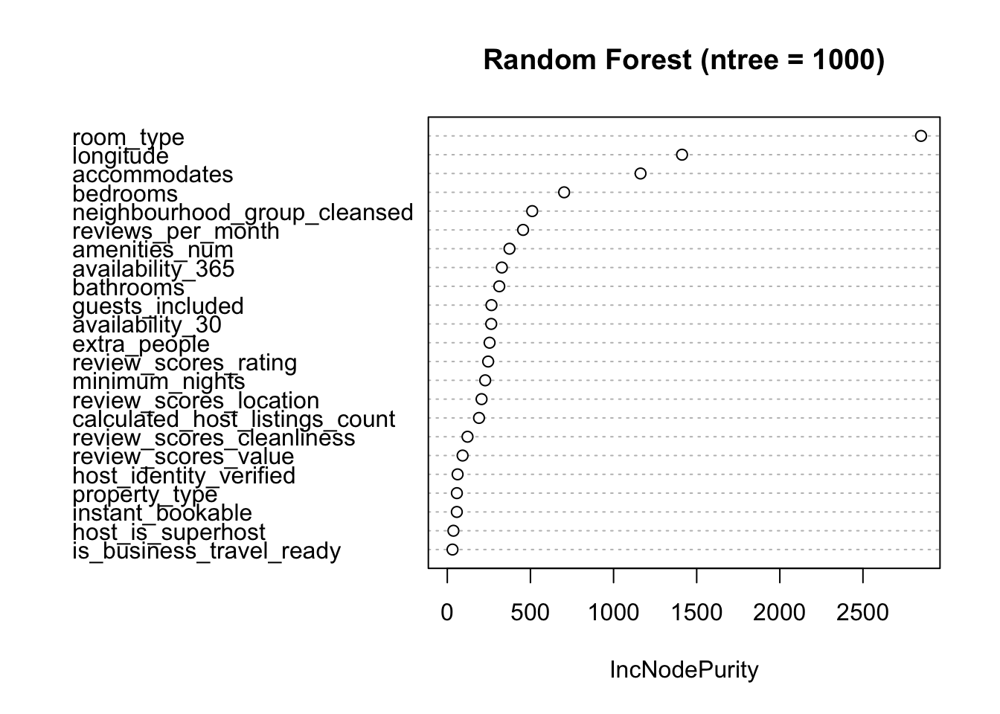
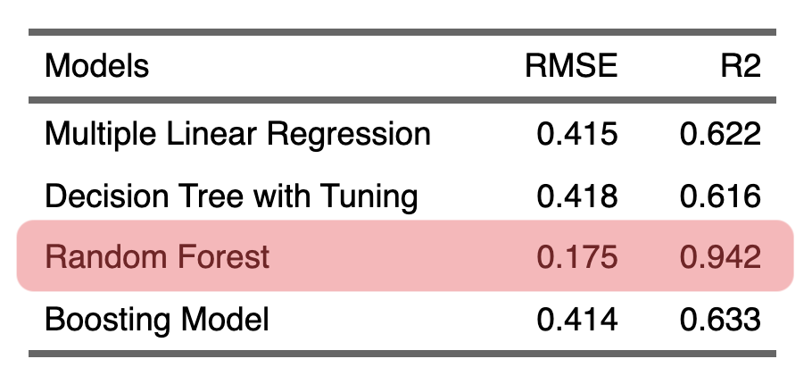

<link rel="stylesheet" href="styles.css" type="text/css">

   

## **AirBnB Price Prediction using ML algorithms**

  

 

#### R Code

For the R code: [[Link](files/airbnb_price_pred_nyc/airbnb_price_pred_nyc.html)]

 

#### Analysis Report

For the analysis report: [[Link](files/airbnb_price_pred_nyc/airbnb_price_pred_nyc_report.pdf)]

 

#### Presentation Slides

For the presentation slides: [[Link](files/airbnb_price_pred_nyc/airbnb_price_pred_nyc_slide.pdf)]

 

#### Project Summary:

This project aims to predict the price for a rental accommodation using various features such as property, reviews, host, location, and so on. To build the best accurate model for price prediction, regression models, machine learning algorithms including random forest, decision tree, and boosting model were used. 

<b> The project component includes the following: </b> 
&nbsp; 1) Data Cleaning  
&nbsp; 2) Exploratory Data Analysis  
&nbsp; 3) Predictive Modeling  
&nbsp; 4) Evaluation, insights, and improvements   