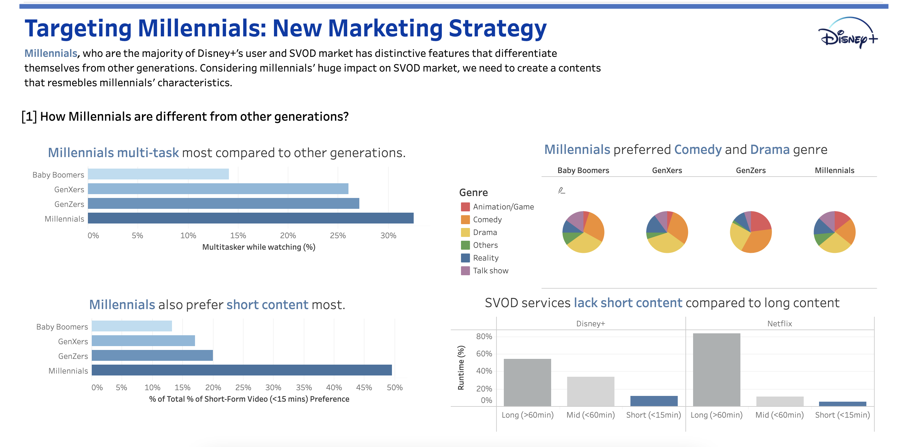

<link rel="stylesheet" href="styles.css" type="text/css">

   

## **Disney+ Strategic Dashboard**

  

#### Tableau Publication

For the Tableau Software dashboard: [[Link](https://public.tableau.com/app/profile/jisu.baek/viz/InteractiveVisualCommunication_Final_JisuBaek/Dashboard1)]

 

 

#### Project Summary:

The goal of this project is to demonstrate the recommended strategic plan that Disney plus should pursue to win millennial customers and dominate the next paradigm of the streaming industry, using "Short-form contents" as a key. 
 
<b>The project component includes the following: </b> 
&nbsp;1) Target segment analysis  
&nbsp;2) Strategic recommendation: Short-form contents  
