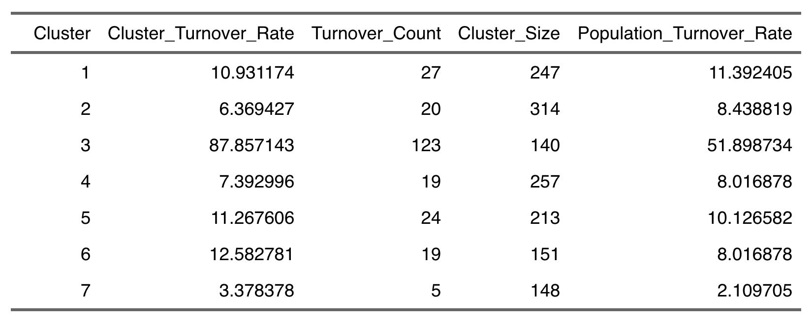

<link rel="stylesheet" href="styles.css" type="text/css">

   

## **IBM retention Prediction using ML algorithms**

  

 

#### R Code

For the R code: [[Link](files/ibm_retention_prediction/ibm_retention_report.html)]

 

#### Presentation Slides

For the presentation slides: [[Link](files/ibm_retention_prediction/ibm_retention_slide.pdf)]

 

#### Project Summary:

The goal of this project is to make a recommendation to reduce the employee attrition rate in IBM. 
 
<b>The project components include the following: </b> 
&nbsp; 1) Using machine learning to predict attrition  
&nbsp; 2) Uncovering key factors that lead to attrition  
&nbsp; 3) Create a persona that characterizes "high-risk" employees   
&nbsp; 4) Recommendation and limitation.  

