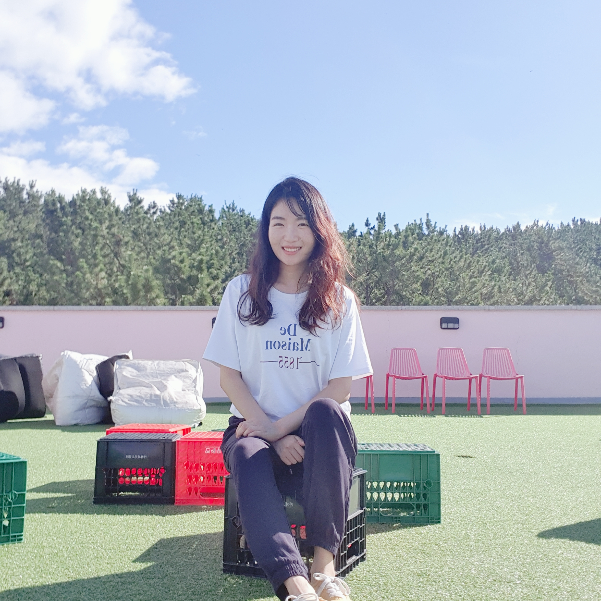

<link rel="stylesheet" href="styles.css" type="text/css">
<link rel="stylesheet" href="academicons/css/academicons.min.css"/>

 

 

👋🏽 Hello! My name is **Jisu Baek** and I live in NYC now. 

🎓 Soon to be grad with a M.S. in Applied Analytics at Columbia University (May, 2022). Finished my B.B.A with an emphasis on Quantitative Methods at Sungkyunkwan University (Seoul, Korea). 

💪🏽 5+ years with specialties in analyzing customer-driven data from on/offline services and applying insights to actionable strategies. 
▪ Programming: R 
▪ Data visualization: Tableau Software, Power BI 
▪ Database: SQL, Postgre SQL, MongoDB, Elasticsearch, Neo4j 

🔥 Aspire to become a leader and designer in data strategy, transformation, and growth to align to customer-centric focus in on/offline business. 

👗 Previously, worked as a Data Analyst - Sales and Marketing at Lotte Department Store where I automated the publishing of KPI reports using real-time Tableau dashboards. Designed and implemented cross-selling strategy between cosmetics and female clothing by performing a Principal Component Analysis (PCA) and Market Basket analysis. Mostly worked on deeply diving into customer insights through data using R, SQL, and Microsoft Excel. 

💻 As for my future, I want to become a mind-mining project leader who can read customers' unmet needs from data and change the world.  

🎹 In my free time, I love to row indoors, play the piano/keyboard, or jigsaw puzzles. 

 

My full resume is available [here](files/Resume_JisuBaek_202111.pdf).

If you have additional questions, please feel free to reach out via [jb4563@columbia.edu](mailto:jb4563@columbia.edu). Thank you.