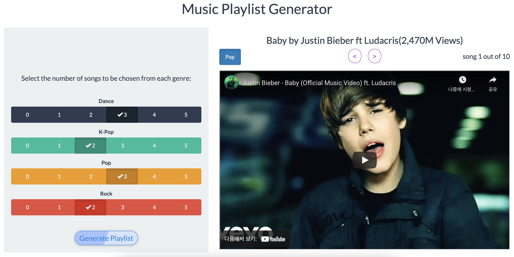

<link rel="stylesheet" href="styles.css" type="text/css">

   

## **Music Generator Web App**

  

#### Live Demo

For the live demo web application: [[Link](https://jisubaek.shinyapps.io/APAN5310_HW9_jb4563/)]

 

 

#### Project Summary:

+ This application is a simple youtube playlist generator that shows lists of random songs

+ Using SQL, the application executes exactly 10 songs that were added up from each of the four genres that are selected by users.

+ The application shows list of songs in most youtube views order. 

+ Using Shiny app in R, the results of SQL queries are displayed in an interactively intuitive manner.

