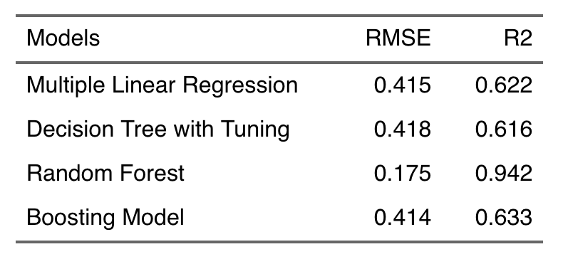

<link rel="stylesheet" href="styles.css" type="text/css">

   

## **AirBnB Price Prediction using ML algorithms**

  

 

#### R Code

For the R code: [[Link](airbnb_price_pred_nyc.html)]

 

#### Analysis Report

For the analysis report: [[Link](files/airbnb_price_pred_nyc/airbnb_price_pred_nyc_report.pdf)]

 

#### Presentation Slides

For the presentation slides: [[Link](files/airbnb_price_pred_nyc/airbnb_price_pred_nyc_slide.pdf)]

 

#### Project Summary: