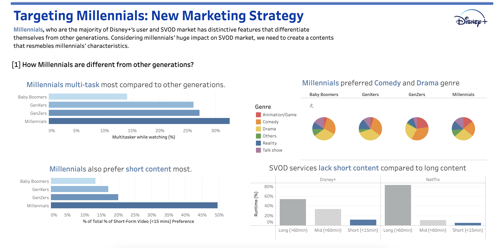

<link rel="stylesheet" href="styles.css" type="text/css">

   

## **Disney+ Strategic Dashboard**

  

#### Tableau Publication

For the Tableau Software dashboard: [[Link](https://public.tableau.com/app/profile/jisu.baek/viz/InteractiveVisualCommunication_Final_JisuBaek/Dashboard1)]

 

 

#### Project Summary:
